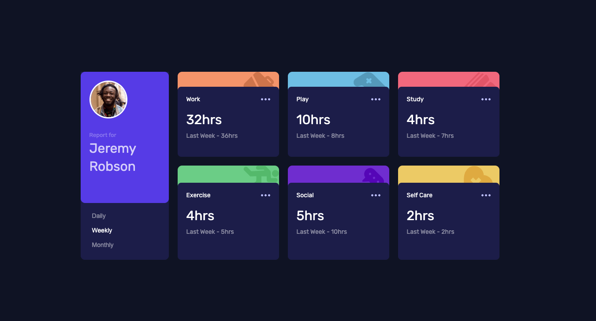

# Overview

### The challenge

Users should be able to:

- Switch between viewing Daily, Weekly, and Monthly stats

### Screenshot

### Links

- Solution URL: [Github](https://github.com/gkuzivam/time-tracking-dashboard/tree/main)
- Live Site URL: [live site](https://time-tracking-dashboard-9kg6libjs-gkuzivams-projects.vercel.app/)

### Built with

- Semantic HTML5 markup
- CSS custom properties
- Flexbox
- CSS Grid
